# 🎉 SS UTSAV — Event Management Platform

> **We Plan. You Celebrate.**

SS UTSAV is an event management platform created to provide professional event planning and management services through a modern digital experience.

🌐 **Live Website:** https://www.ssutsav.in

---

## 📌 Project Overview

SS UTSAV is designed to help customers explore event services, understand available offerings, view previous work, and connect with the team for event requirements.

The platform provides a professional online presence for an event management business while establishing a foundation for future business and administrative workflows.

---

## ✨ Key Features

- 🏠 Professional customer-facing website
- 🎉 Event management service showcase
- 📦 Service and package presentation
- 🖼️ Event gallery
- 🔄 How It Works section
- ⭐ Customer testimonials
- 📩 Customer enquiry / quote workflow
- 📱 Responsive user interface
- 🔐 Backend API architecture
- ⚙️ Separate frontend and backend structure
- 🚀 Cloud deployment

---

## 🏗️ Architecture

```text
                    ┌──────────────────────┐
                    │      Customer        │
                    │      Browser         │
                    └──────────┬───────────┘
                               │
                               ▼
                    ┌──────────────────────┐
                    │     SS UTSAV         │
                    │   Frontend Website   │
                    └──────────┬───────────┘
                               │
                         REST API Calls
                               │
                               ▼
                    ┌──────────────────────┐
                    │      Backend         │
                    │      FastAPI         │
                    └──────────┬───────────┘
                               │
                               ▼
                    ┌──────────────────────┐
                    │       MySQL          │
                    │      Database        │
                    └──────────────────────┘
```

---
## 🛠️ Technology Stack

### Frontend
- Next.js
- TypeScript
- Responsive UI

### Backend
- Python
- FastAPI
- REST APIs

### Database
- MySQL

### Deployment & Version Control
- Git
- GitHub
- Render

---

## 🎯 Project Objectives

- Create a professional online presence for SS UTSAV
- Showcase event management services and offerings
- Provide customers with an easy way to explore services
- Provide a foundation for customer enquiries and business workflows
- Build the application using a separate frontend and backend architecture
- Deploy the application for public access

---

## 👨‍💻 My Role

**Full-Stack Developer**

I worked on the development and deployment of the SS UTSAV platform, including:

- Frontend development
- Backend API development
- Database integration
- Frontend–backend integration
- Application structure and architecture
- Deployment and configuration
- Git/GitHub workflow

---

## 🌐 Live Project

### SS UTSAV

**Live Website:**  
https://www.ssutsav.in

---

## 📸 Project Screenshots

### 🏠 Home

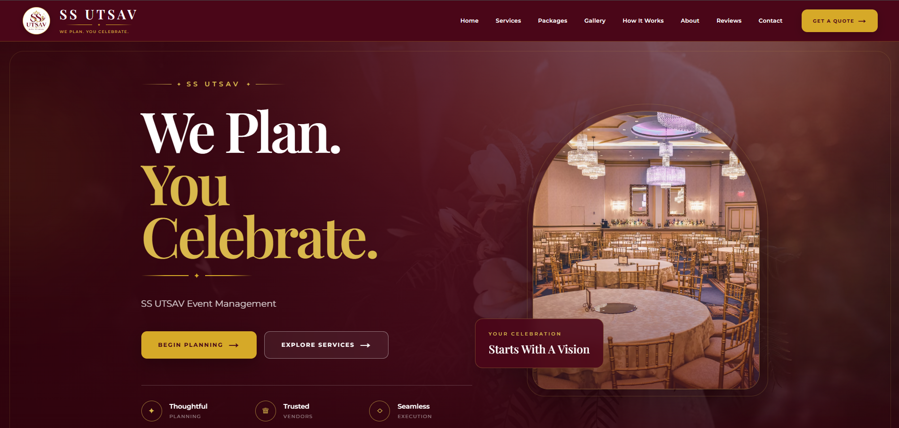

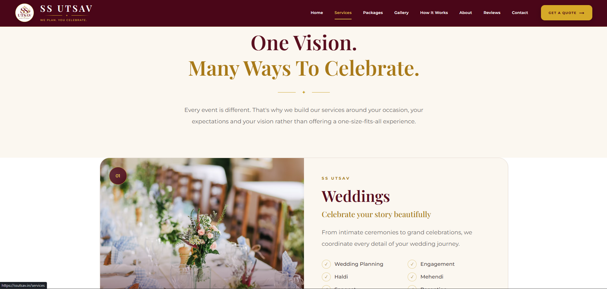

---

### 🎉 Services & Packages

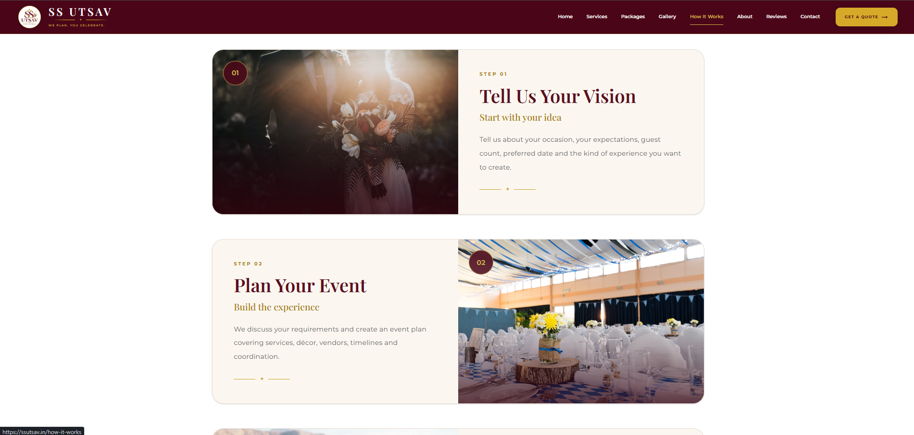

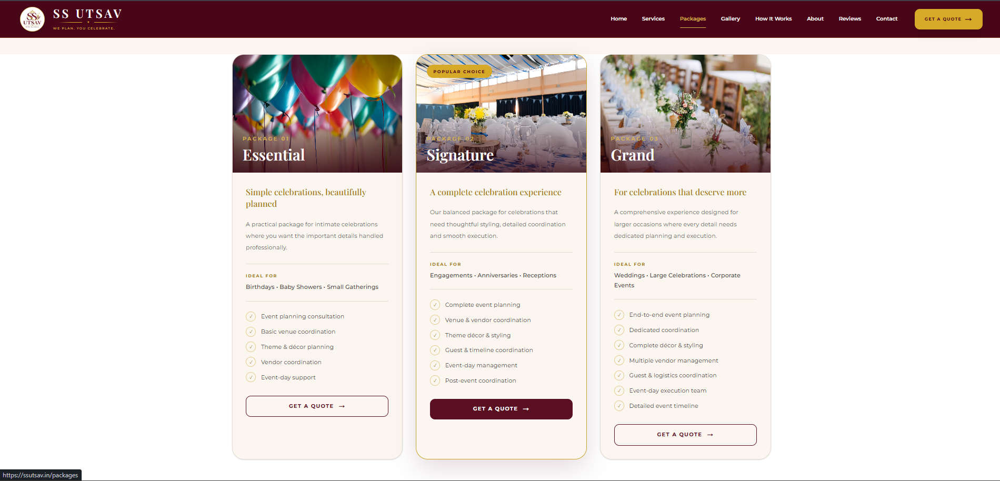

---

### 🖼️ Gallery & Reviews

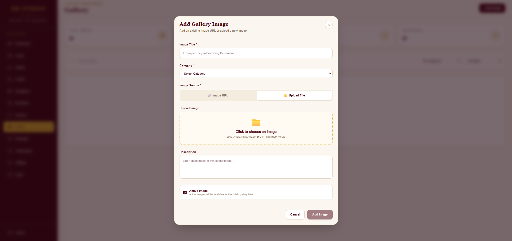

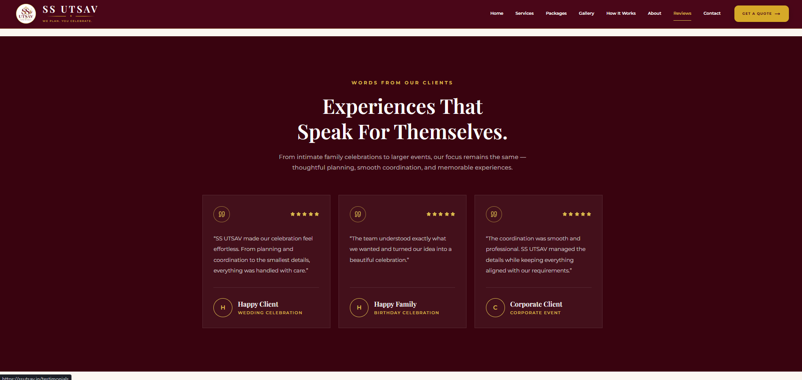

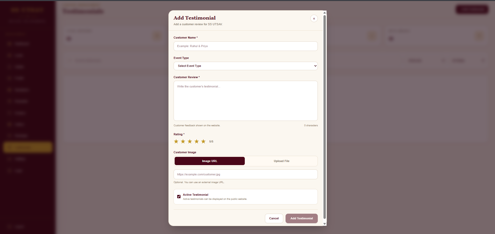

---

### 📩 Contact & Quote

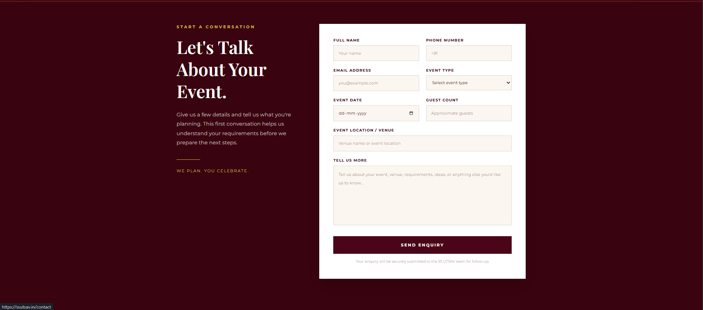

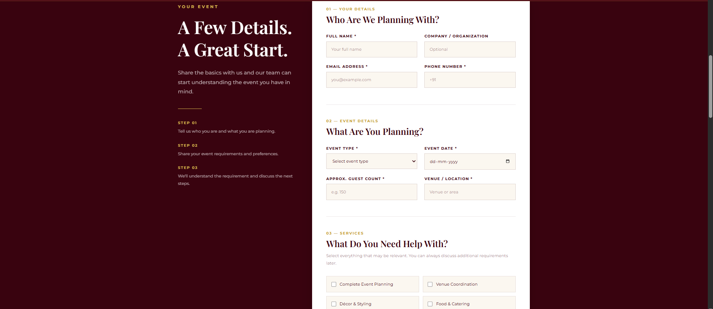

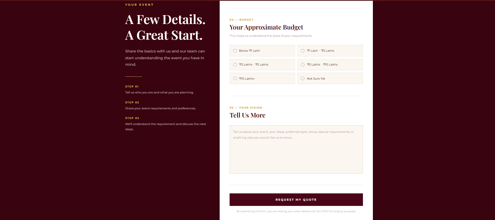

---

### ⚙️ Admin

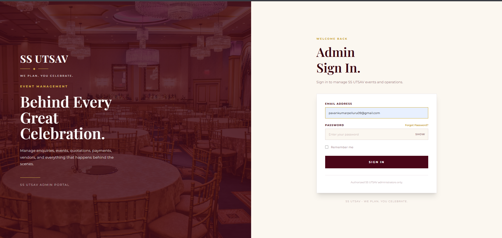

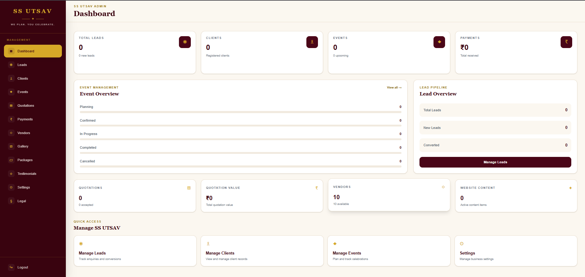

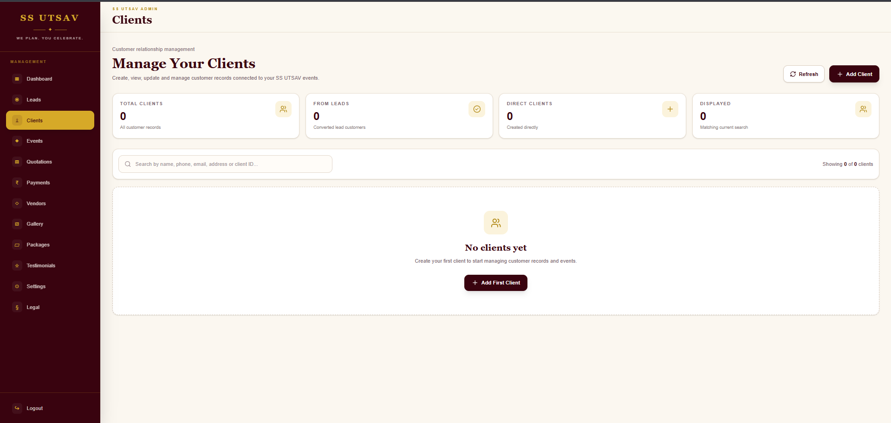

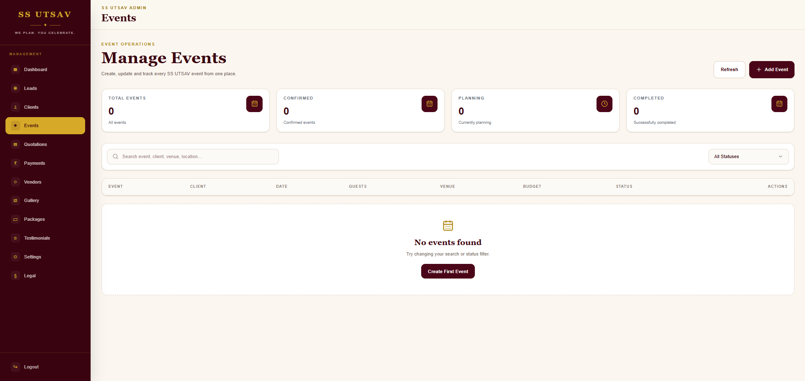

---

## 🔐 Source Code

The production source code repository is kept **private**.

This public repository is intended to provide project documentation, screenshots, architecture information, technology details, and the live project link without exposing the production source code.

---
## 🚀 Future Development

Potential future enhancements include:

- Payment management
- Vendor management
- Task management
- Calendar and scheduling
- Expense tracking
- Business reports
- Additional automation and management features

---

## 📄 Project Details

| Category | Details |
|---|---|
| Project | SS UTSAV |
| Type | Event Management Platform |
| Application | Full-Stack Web Application |
| Frontend | Next.js + TypeScript |
| Backend | FastAPI |
| Database | MySQL |
| Deployment | Render |
| Status | Live |
| Website | https://www.ssutsav.in |

---

## 🎉 SS UTSAV

> **We Plan. You Celebrate.**


